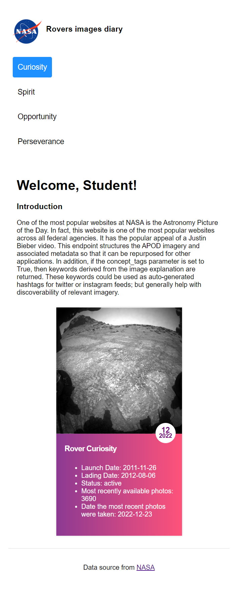
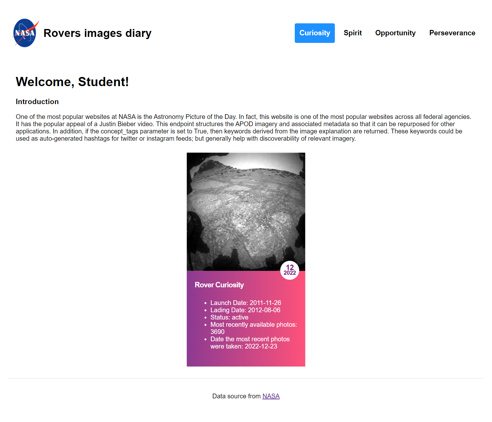

# Functional Programming with Javascript 

### Big Picture

We are going to create a Mars rover dashboard that consumes the NASA API. The dashboard will allow the user to select which rover's information they want to view.

### Started

Follow these steps to run project:

1. install npm package ```npm install```

2. Run `npm run start` in your terminal and go to `http:localhost:3000` to check that your app is working. If you don't see an image on the page, check that your api key is set up correctly.

### Screen shot
#### Mobile screen shot

#### Lager than Mobile size



